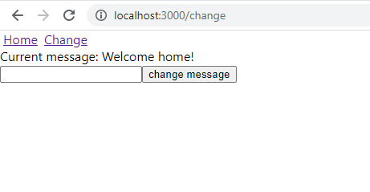

# [Codelab] Start a React project

- [[Codelab] Start a React project](#codelab-start-a-react-project)
  - [introduction](#introduction)
  - [create](#create)
  - [router](#router)
  - [redux](#redux)
  - [tear down](#tear-down)

## introduction

after completing this codelab you will learn:
- how to use the `create-react-app` toolchain to create a basic react app
- install and set up a router for your app
- install and set up `redux`

## prerequisites

- recent version of `Node.js` installed. check current LTS at: https://nodejs.org/es/

## create

the recommended way to create a `React` app is using the `create-react-app` toolchain. no installation is required, just go to your workspace directory and run:

```sh
npx create-react-app react-codelab
cd react-codelab
yarn start
```

you should now see the welcome page that was automatically generated for you. we will be replacing it soon. for now create the following files in their respective directories. the first line of each snippet will tell you where the file is supposed to be.

```jsx
// react-codelab/src/components/HomeView.js
import React from 'react'

const HomeView = () => {
    return (
        <div>Welcome home!</div>
    )
}

export default HomeView
```

```jsx
// react-codelab/src/components/ChangeMessageView.js
import React from 'react'

const ChangeMessageView = () => {
    return (
        <div>
            <div>Current message: Welcome home!</div>
            <input type='text'></input>
            <button>change message</button>
        </div>
    )
}

export default ChangeMessageView
```

## router

having these new components is all well and good, but we still need a way to manage when to show each one. enter [React Router](https://reactrouter.com/), with over 40k Github stars this library has become the de-facto routing library for `React`. start by installing it:

```sh
yarn add react-router-dom
```

now replace the entire code in `App.js` with this:

```jsx
// react-codelab/src/App.js
import React from 'react';
import './App.css';
import {
    BrowserRouter as Router,
    Switch,
    Route,
    Redirect,
    Link
} from "react-router-dom"

import HomeView from './components/HomeView'
import ChangeMessageView from './components/ChangeMessageView'

function App() {
    return (
        <Router>
            {/* Notice the nav is outside the Switch component, we do this to have the nav be rendered regardless of the Route */}
            <nav>
                <Link to='/home' style={{ padding: '4px' }}>Home</Link>
                <Link to='/change' style={{ padding: '4px' }}>Change</Link>
            </nav>
            <Switch>
                <Route exact path='/'>
                    <Redirect to='/home' />
                </Route>
                <Route exact path='/home'>
                    <HomeView />
                </Route>
                <Route exact path='/change'>
                    <ChangeMessageView />
                </Route>
                <Route>
                    {/* default route will be displayed when no other route matches */}
                    {/* TODO: replace with a more elaborated component */}
                    <div>Page not found</div>
                </Route>
            </Switch>
        </Router>
    );
}

export default App;
```

now we have an app with two views: the `home` view and the `change` view. 
notice the `change` view displays the current message, but for now it's hardcoded in the component. we will change this later.
the `change` view also has a button without no behavior.

`/home`


`/change`


## redux

if you navigate the app you will notice that both `/home` and `/change` are showing the welcome message, and `/change` has a small form that is meant to update the welcome message. for now the welcome message is hardcoded, meaning that if you change `ChangeMessageView` to display a different message, `HomeView` will continue to show the same and the views won't be synced. in additon, the form in `/change` does nothing for now.
the problem of keeping the welcome message synced across both views falls into the domain of [state management](https://en.wikipedia.org/wiki/State_management). you need to decide where the value for the message string is going to be stored, and how the views are going to access it. there are many ways to solve this problem, but in this codelab we will be using a popular general-purpose state management library: `Redux`. 
to use `Redux` all you need is the `redux` npm package, but when you use `Redux` in a `React` project, you face the following problem: how will components access the store? you might be tempted to have the store created and exported in a file, and then import it in the components that use it, but that generates high coupling between the components and the store, what if you want to reuse the same component with different stores? you could pass the store as a prop down to every component that needs it, but doing so would be extremely tedious since now there's this one prop that has to be passed to absolutely every single component. there's a `React` feature called [Context](https://reactjs.org/docs/context.html) that makes this easier by allowing you to share values from a given component down to every single nested component without explicitly passing it every single time. this sounds perfect! but this is also exactly what a library named `react-redux` does. it does so by prodiving two things:
- `Provider` component: a component that receives the store as a prop, then shares it through Context to every single nested component.
- `connect` function: used from components to access the store indirectly (i.e: instead of using the store object directly, functions `mapStateToProps` and `mapDispatchToProps` are defined). `connect` is technically a [Higher-Order Component](https://reactjs.org/docs/higher-order-components.html), meaning that you feed it a component (plus the aforementioned functions to map state and dispatch to props) and it returns a component. the returned component will be using the store provided.

go ahead and install this:

```sh
yarn add redux react-redux
```

create a directory named `redux` inside `react-codelab/src`. we will use it to store all the redux-related files

```js
// react-codelab/src/redux/actions.js
export const SET_MESSAGE = 'SET_MESSAGE'

export const setMessage = message => ({
    type: SET_MESSAGE, 
    payload: {
        message: message
    } 
})
```

```js
// react-codelab/src/redux/reducer.js
import { SET_MESSAGE } from './actions'

const initialState = {
    message: 'Welcome home!'
}

function reducer(state = initialState, action) {
    switch(action.type) {
        case SET_MESSAGE:
            return { ...state, message: action.payload.message }
        default:
            return state
    }
}

export default reducer
```

```js
// react-codelab/src/redux/store.js
import { createStore } from 'redux'
import reducer from './reducer'
export default createStore(reducer)
```

these three files should look familiar if you have used `Redux` before, they are React-agnostic.

now we have to update `App.js` so it provides the store to all components in the application. components outside of the `Provider` component will fail to call the `connect()` function (needed to access the store), that's why `Provider` is the root element,

```jsx
// react-codelab/src/App.js
import React from 'react';
import './App.css';
import {
    BrowserRouter as Router,
    Switch,
    Route,
    Redirect,
    Link
} from "react-router-dom"
import { Provider } from 'react-redux'

import store from './redux/store'

import HomeView from './components/HomeView'
import ChangeMessageView from './components/ChangeMessageView'

function App() {
    return (
        <Provider store={store}>
            <Router>
                {/* Notice the nav is outside the Switch component, we do this to have the nav be rendered regardless of the Route */}
                <nav>
                    <Link to='/home' style={{ padding: '4px' }}>Home</Link>
                    <Link to='/change' style={{ padding: '4px' }}>Change</Link>
                </nav>
                <Switch>
                    <Route exact path='/'>
                        <Redirect to='/home' />
                    </Route>
                    <Route exact path='/home'>
                        <HomeView />
                    </Route>
                    <Route exact path='/change'>
                        <ChangeMessageView />
                    </Route>
                    <Route>
                        {/* default route will be displayed when no other route matches */}
                        {/* TODO: replace with a more elaborated component */}
                        <div>Page not found</div>
                    </Route>
                </Switch>
            </Router>
        </Provider>
    );
}

export default App;
```

now we would like to have `HomeView` take the value of the welcome message from the `Redux` store. update `HomeView` like this:

```jsx
// react-codelab/src/components/HomeView.js
import React from 'react'
import { connect } from 'react-redux'

const HomeView = ({ message }) => {
    return (
        <div>{message}</div>
    )
}

const mapStateToProps = (state) => ({
    message: state.message
})

export default connect(mapStateToProps)(HomeView)
```

if everything was done right, you should continue to see the same as before.

now we have to do the same with `ChangeMessageView`, the difference is that this one is also going to dispatch an action whenever the `change message` button is clicked. Update `ChangeMessageView` like this:

```jsx
// react-codelab/src/components/ChangeMessageView.js
import React, { useState } from 'react'
import { connect } from 'react-redux'
import { setMessage } from '../redux/actions'

const ChangeMessageView = ({ message, setMessage }) => {

    /**
     * notice we use useState() to store the text written in the <input />
     * you may be wondering why we don't simply call setMessage everytime
     * the onInput callback is called. you might do that, but that will give
     * you different behavior. if you want to wait until the button is pressed
     * before you update the global redux state, then you need to do it like this.
     * if instead, you want the global redux state to be updated on every key
     * that is pressed in the <input />, then you could simply call setMessage
     * in the onInput callback. neither is wrong, they are just different behaviors.
     * it all depends on when you want to update the redux global store.
     * go ahead and replace the call to setInputText() with a call to setMessage(),
     * you will notice the welcome message changing as you write. also, the button
     * now becomes useless.
     */
    const [inputText, setInputText] = useState('')

    return (
        <div>
            <div>Current message: {message}</div>
            <input type='text' onInput={e => setInputText(e.target.value)}></input>
            <button onClick={() => inputText && setMessage(inputText)}>change message</button>
        </div>
    )
}

const mapStateToProps = (state) => ({
    message: state.message
})

const mapDispatchToProps = (dispatch) => ({
    setMessage: message => dispatch(setMessage(message))
})

export default connect(mapStateToProps, mapDispatchToProps)(ChangeMessageView)
```

now you should be able to change the welcome message by going to `/change`, filling the input with a new message and clicking the `change message` button. try it out and then navigate to `/home` to confirm they are both displaying the same welcome message.

you are now ready to start adding new components, new routes and new `Redux` actions to your application.

## tear down
stop the app and delete the app directory
```sh
# Ctrl+C to stop the app
cd ..
rm -rf react-codelab
```

[Go back](../README.md)